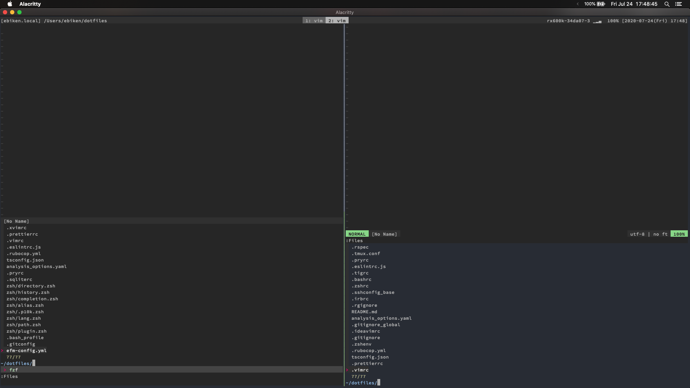

Vim から neovim に移行したのでメモ

# モチベ
- neovim使ったことないので試してみたい
- neovimじゃないと使えない機能がある
  - coc.nvim の VIRTUAL_TEXT とか

# 手順

最終的な設定は [dotfiles](https://github.com/ebkn/dotfiles) のリポジトリを参照

### インストール
- `brew install neovim`
- `:help nvim-from-vim`を読む
- `~/.config/nvim/init.vim` 作成

```sh
set runtimepath^=~/.vim runtimepath+=~/.vim/after
let &packpath = &runtimepath
source ~/.vimrc
```

### `ttymouse` optionを書き換える

```.vimrc
if !has('nvim')
  set ttymouse=xterm2
endif

```
### vimと共存するためシンボリックリンクとかで設定ファイルやautoloadのディテクトリを共有
dotfilesで管理してるのでdotfilesベースで

```sh
ln -s ~/dotfiles/vim/nvim/init.vim ~/.config/nvim/init.vim
ln -s ~/dotfiles/vim/.vim/* ~/.config/nvim/
```

最終的に` ~/.vim` と `~/.config/nvim` の中身が `init.vim` 以外同じになってれば良い

### エラーを潰していく
ここから `:checkhealth `で発生している問題を確認しながら解決していく

#### tmux
発生したエラー
```
## tmux
OK: escape-time: 1ms
INFO: $TERM: xterm-256color
INFO: default-terminal: screen-256color
ERROR: $TERM differs from the tmux `default-terminal` setting. Colors might look wrong.
  ADVICE:
    $TERM may have been set by some rc (.bashrc, .zshrc, ...).
WARNING: Neither Tc nor RGB capability set. True colors are disabled. 'termguicolors' won't work properly.
  ADVICE:
    Put this in your ~/.tmux.conf and replace XXX by your $TERM outside of tmux:
      set-option -sa terminal-overrides ',XXX:RGB'
    For older tmux versions use this instead:
      set-option -ga terminal-overrides ',XXX:Tc'
```

解決
`.tmux.conf `の変更

```.vimrc
# color
set -g default-terminal "screen-256color"
set-option -sa terminal-overrides ",*256col*:RGB"
```

`.zshrc `の変更

```.zshrc
export TERM=screen-256color
set termguicolors

```

#### Pythonのprovider
発生したエラー
```sh
## Python 2 provider (optional)
  INFO: pyenv: Path: /usr/local/Cellar/pyenv/1.2.20/libexec/pyenv
  WARNING: pyenv: Root does not exist: /Users/ebiken/.pyenv. Ignoring pyenv for all following checks.
  WARNING: No Python executable found that can `import neovim`. Using the first available executable for diagnostics.
  ERROR: Python provider error:
    ADVICE:
      provider/pythonx: Could not load Python 2:
        /usr/bin/python2 does not have the "neovim" module. :help provider-python
        /usr/bin/python2.7 does not have the "neovim" module. :help provider-python
        python2.6 not found in search path or not executable.
        /usr/bin/python does not have the "neovim" module. :help provider-python
  INFO: Executable: Not found

## Python 3 provider (optional)
  INFO: pyenv: Path: /usr/local/Cellar/pyenv/1.2.20/libexec/pyenv
  WARNING: pyenv: Root does not exist: /Users/ebiken/.pyenv. Ignoring pyenv for all following checks.
  WARNING: No Python executable found that can `import neovim`. Using the first available executable for diagnostics.
  ERROR: Python provider error:
  ADVICE:
    provider/pythonx: Could not load Python 3:
      /usr/local/bin/python3 does not have the "neovim" module. :help provider-python
        python3.7 not found in search path or not executable.
        python3.6 not found in search path or not executable.
        python3.5 not found in search path or not executable.
        python3.4 not found in search path or not executable.
        python3.3 not found in search path or not executable.
        /usr/bin/python is Python 2.7 and cannot provide Python 3.
  INFO: Executable: Not found
```

解決

```sh
python2 -m pip install --user --upgrade pynvim
python3 -m pip install --user --upgrade pynvim
```


#### Rubyのprovider
発生したエラー
```sh
## Ruby provider (optional)
  INFO: Ruby: ruby 2.6.3p62 (2019-04-16 revision 67580) [universal.x86_64-darwin19]
  WARNING: `neovim-ruby-host` not found.
    ADVICE:
      Run `gem install neovim` to ensure the neovim RubyGem is installed.
      Run `gem environment` to ensure the gem bin directory is in $PATH.
      If you are using rvm/rbenv/chruby, try "rehashing".
      See :help g:ruby_host_prog for non-standard gem installations.
```

解決
```sh
sudo gem install neovim
```

#### Node.jsのprovider
発生したエラー
```sh
## Node.js provider (optional)
  INFO: Node.js: v14.5.0
  WARNING: Missing "neovim" npm (or yarn) package.
    ADVICE:
      Run in shell: npm install -g neovim
      Run in shell (if you use yarn): yarn global add neovim
```

解決
```sh
`npm i -g neovim`
```

## `:checkhealth`以外で発生したエラー
`clipboard`の設定

```sh
Error detected while processing /Users/ebiken/dotfiles/vim/base.vim:
line  103:
E474: Invalid argument: clipboard=unnamed,autoselect
```

解決
`nvim `のときは `autoselect `を指定しないようにして解決
  - サポートしてないらしい

```sh
if has('nvim')
  set clipboard=unnamed
else
  set clipboard=unnamed,autoselect
endif
```

# 移行した結果
`fzf.vim` の見た目がいい感じになった (左 neovim、右 vim8)


速さの違いはまだわからない。大きなファイルを扱うときに違いが出るかも？
