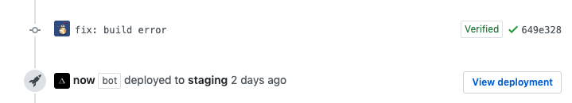

こんにちは、[ebiken](https://twitter.com/ebikentennis)です。

1年くらい前に作ったポートフォリオサイトを作り直してブログ機能をつけました。
色々はてなブログ、Qiita、note、Mediumとかも考えましたが、独自ドメインを使いたかったのと、フロントで遊べる場所に丁度いいなと思ったので自分で作ることにしました。

ブログ機能をつけた技術スタックや感想とかを書いていきます。

コードは公開しています。  
[ebkn/portfolio](https://github.com/ebkn/portfolio)

---

## 技術スタック
今回はこんな感じになりました

- [TypeScript](https://github.com/microsoft/TypeScript)
- [React](https://github.com/facebook/react)
- [Gatsby](https://github.com/gatsbyjs/gatsby)
- [styled components](https://github.com/styled-components/styled-components)
- [GitHub Actions](https://github.com/features/actions)
- [Now](https://zeit.co/home)

GatsbyとNowについて軽く紹介します

#### Gatsby


[gatsbyjs.org](https://www.gatsbyjs.org/)  
[GitHub](https://github.com/gatsbyjs/gatsby)

> Gatsby is a free and open source framework based on React that helps developers build blazing fast websites and apps

Gatsbyは、Reactベースで作成されている爆速サイトを作るフレームワークです。  
プラグインを入れることでMarkdownのパーサーやPWA対応などをいれることができます。

[plugins](https://www.gatsbyjs.org/plugins/)

有名なサイトでの採用事例も結構あり、ブログサイトだと有名な [overreacted.io](https://overreacted.io) もGatsbyで作られています  
どういう仕組みで動いているのかわかりやすく解説してくれている記事があったので貼っておきます
- [Reactベース静的サイトジェネレータGatsbyの真の力をお見せします - Qiita](https://qiita.com/uehaj/items/1b7f0a86596353587466)

#### Now


[zeit.co/home](https://zeit.co/home)  
[GitHub](https://github.com/zeit/now)

> All-in-one solution for static & JAMstack deployment for performance-obsessed teams.

Nowは、Zero configの静的サイトホスティングサービスです。  
証明書の設定や独自ドメインの指定、CD(GitHubなどと連携)もあり、個人で使う分には無料で使うことができると思います。

## 主にやったこと

- Markdownでブログを書く
- コードのsyntax highlight
- ダークモード
- PWA化(オフライン対応)
- GatsbyのTypeScript対応
- CI - GitHub Actions
- CD - Now

#### Markdownでブログを書く + コードのsyntax highlight
`/content/blog/${title}/index.md` に記事を書くと `/blog/${title}` に追加されるようにしました。  
[gatsby-starter-blog](https://github.com/gatsbyjs/gatsby-starter-blog) のコードを参考に実装しました。  
Syntax Highlightは `gatsby-remark-prismjs` で導入しており、プラグインで用意されているテーマ(数が少ない)を使うか、prismjs用に書かれたCSSを探してくるのが良さそうです。ドキュメントには `gatsby-browser.js` で `require` してと書いてありますが、自分はlight/darkモードでスタイルを分けたかったので `layout.tsx` に書いています。

[gatsby-remark-prismjs](https://www.gatsbyjs.org/packages/gatsby-remark-prismjs/)

[prismjs](https://prismjs.com/)


#### ダークモード
右上のアイコンをクリックするとlight/darkモードのスタイルを切り替えるようにしました。  
最初は [dark-mode-toggle](https://github.com/GoogleChromeLabs/dark-mode-toggle) を使ってやろうとしてたんですが、Reactコンポーネントで状態管理したかったので使いませんでした。ダークモードが有効になっているブラウザでは `prefers-color-scheme` を見るようにしたり、状態をlocalstorageに入れて保持するようにもしました。
```js
if (window.matchMedia && window.matchMedia('(prefers-color-scheme: dark)').matches) {
  // dark mode
}
```

スタイルは `layout.tsx` に書き、 `body.light`/`body.dark` セレクタにCSS Variablesで色を定義しています。  
また、色を切り替える関数はReact Contextで定義して子コンポーネントから変更できるようにしました。

```css
body.light {
  --bg-color: #FAFAFA;
  ...
}
body.dark {
  --bg-color: #212121;
  ...
}
```
```tsx
const DarkModeToggleButton: React.FC<{}> = () => {
  const toggle = useContext<DarkModeToggleContextType>(DarkModeToggleContext);
  return <button onClick={toggle}>;
};
```

このあたりが参考になりました。
- [Hello darkness, my old friend - web.dev](https://web.dev/prefers-color-scheme/)
- [prefers-color-scheme を用いた Dark Mode 対応と User Preference Media Features - blog.jxck.io](https://blog.jxck.io/entries/2018-11-10/dark-mode-via-prefers-color-scheme.html)


#### Gatsby の TypeScript 対応
公式のプラグイン `gatsby-plugin-typescript` を入れるだけでTypeScriptで書けるようになります。すごく楽でした。  
また、Gatsbyはサーバーで用意したコンテンツ(metaタグ、ブログの投稿など)の配信に [GraphQL](https://graphql.org/) を使用しており、それを `/page` 以下のファイルに `pageQuery` という形で書くことで `props` から取得することがなっています。  
この型定義は自動生成したいので、 `gatsby-plugin-graphql-codegen` というプラグインを使用しました。
```js
// gatsby-config.js
...
{
  resolve: 'gatsby-plugin-graphql-codegen',
  options: {
    fileName: 'types/gql.d.ts',
  },
},
...
```
これで型は生成されるのですが、 `type Maybe<T> = T | null` が大量に含まれているので、最近TypeScriptに入ったOptional Chainingをいれました。 `npm i -D @babel/plugin-proposal-optional-chaining` して `.babelrc` に以下を書くと使えます。

```json:
{
  "plugins": [
    "@babel/plugin-proposal-optional-chaining"
  ],
  "presets": [
    "babel-preset-gatsby"
  ]
}
```

Optional Chainingについてはここを参考にしました
- [proposal](https://github.com/tc39/proposal-optional-chaining)
- [MDN](https://developer.mozilla.org/en-US/docs/Web/JavaScript/Reference/Operators/Optional_chaining)
- [TypeScript3.7 リリースノート](https://devblogs.microsoft.com/typescript/announcing-typescript-3-7/#optional-chaining)


#### PWA化(オフライン対応)
基本的にはGatsbyの `gatsby-plugin-offline`, `gatsby-plugin-manifest` プラグインを入れるだけで設定できるのでかなり楽でした。  
Service Worker (`gatsby-plugin-offline` プラグインは [Workbox](https://developers.google.com/web/tools/workbox) でラップされている)の挙動をカスタマイズしたい場合は自分で `sw.js` を書いて指定することもできます。
```js
// sw.js
if (workbox) {
  workbox.precaching.precacheAndRoute(self.__precacheManifest || []);
  workbox.googleAnalytics.initialize();
  workbox.routing.registerRoute(
    /.js/,
    new workbox.strategies.NetworkFirst(),
  );
  workbox.routing.registerRoute(
    /\.(?:png|gif|jpg|jpeg|svg|ico)$/,
    new workbox.strategies.CacheFirst({
      cacheName: 'images',
      plugins: [
        new workbox.expiration.Plugin({
          maxEntries: 60,
          maxAgeSeconds: 30 * 24 * 60 * 60,
        }),
      ],
    }),
  );
} else {
  console.log('failed to load workbox');
}
```

#### CI/CD - GitHub Actions + Now
CIは [GitHub Actions](https://github.com/features/actions) で構築しました。ちょうど1週間前くらいにβが外れて正式版になり触らなきゃと思ってたので、サクッと学べて丁度良かったです。GitHub公式のCIなのでGitHubで完結してくれるのは良いです。
```yml
---
name: main

on: [push]

jobs:
  build:
    runs-on: ubuntu-18.04
    steps:
      - uses: actions/checkout@v1
      - uses: actions/setup-node@v1
        with:
          node-version: 12
      - name: cache node_modules
        uses: actions/cache@v1
        with:
          path: node_modules
          key: npm-packages-${{ hashFiles('package-lock.json') }}
          restore-keys: |
            npm-packages
      - run: npm install
      - run: npm run build
```

CDはNowの [GitHub integration](https://zeit.co/docs/v2/git-integrations/zeit-now-for-github) という機能を使ったのですが、これが最高でした。default branchに設定されているブランチにコミットされると自動でproductionデプロイが走り、それ以外のブランチはstagingデプロイがされプレビュー用のURLがPRに貼られます。  
ほとんど設定すること無くこれが使えるのは凄いです。



---

Gatsby, Now, GitHub Actionsあたりが人気だったので気になっていましたが、実際触ってみて結構良かったので布教していきます。

今後の機能追加はこのあたりをやる予定です。また、さらに良いやつがでてきたらどんどん作り変えて行こうと思ってます。

- [textlint](https://github.com/textlint/textlint) の導入
- OGP用画像の生成
- RSS feedの設定

作業ログとか下書きは [Scrapbox](https://scrapbox.io/ebiken/爆速ブログを作った) に書いています
